# 하냥냥 (Hanyangnyang) 프로젝트

한양대학교 학생 커뮤니티 앱. Capacitor 기반 하이브리드 앱으로 Android / iOS 동시 지원.

## 어플 소개글
에리카생에게 필요한 정보와 기능을 꾹꾹 눌러담은 서비스
한양대학교 ERICA 학생들을 위한 필수 캠퍼스 라이프스타일 유틸리티 앱, 하냥냥입니다!

주요 제공 기능
• 식당별 학식 조회
• 셔틀버스&지하철 시간표
• 단과대별 제휴 정보 모음 
• 날씨와 학정 혼잡도
• 편리한 학교 생활을 위한 기타 기능

하냥냥과 함께 더욱 슬기롭고 귀여운 에리카 캠퍼스 라이프를 즐겨보세요!

## 기술 스택

- **프론트엔드**: React + Vite (Capacitor WebView로 래핑)
- **Android**: Capacitor + Java (Kotlin 전환 예정)
- **iOS**: Capacitor (Codemagic으로 빌드)
- **BFF / API**: Vercel Serverless Functions — 학식 스크래핑, 지하철·날씨·도서관 프록시, Instagram 프록시 (CORS 차단·API Key 보호 역할)
- **DB / Auth**: Supabase — 익명 Auth, FCM 구독·알림 설정(subscriptions·devices), 배너, 피드백, app_config
- **푸시 알림**: Firebase Cloud Messaging (FCM) — Capacitor 네이티브(Android/iOS) + Web 동시 지원
- **에러 모니터링**: Sentry (@sentry/capacitor + @sentry/react, 프로덕션 빌드에서만 활성화)
- **사용자 분석**: PostHog
- **외부 API (Vercel에서 호출)**: Open-Meteo(날씨·대기질), 서울 열린데이터(지하철), 공공데이터포털(공휴일), 한양대 도서관 API, Google Gemini(날씨 코멘트 AI 생성), Instagram API

## 아키텍처

### 데이터 흐름 원칙

- 앱은 외부 API를 **절대 직접 호출하지 않음** — 반드시 Vercel BFF를 경유
- Supabase는 클라이언트에서 직접 연결 (Auth·DB·RPC)
- FCM 토큰은 네이티브 레이어에서 발급 → Supabase에 저장 → 서버에서 발송

### 소스 코드 구조 (Clean Architecture)

```
src/
├── presentation/      # UI (React 컴포넌트, Hook, Context)
├── domain/            # 비즈니스 로직 (Entity, UseCase, Repository 인터페이스)
├── data/              # 데이터 레이어 (DataSource, Repository 구현체)
├── infrastructure/    # 플랫폼 종속 (HttpClient, SecureStorage)
├── lib/               # 외부 SDK 초기화 (firebase.js, supabase.js, platform.js)
└── di.js              # 의존성 주입 컨테이너
```

### 아키텍처 다이어그램

```mermaid
graph TD
    subgraph Client["📱 클라이언트 (Capacitor)"]
        subgraph WebView["React WebView"]
            UI["UI Layer\n(Presentation)"]
            UC["UseCase Layer\n(Domain)"]
            Repo["Repository Layer\n(Data)"]
        end
        NativeLayer["Native Layer\n(Android / iOS)"]
    end

    subgraph Vercel["☁️ Vercel (BFF / Serverless)"]
        MenuAPI["api/menu.js\n학식 스크래핑"]
        SubwayAPI["api/subway.js\n지하철 시간표"]
        PortalAPI["api/portal.js\n날씨 · 도서관"]
        InstaAPI["api/insta-proxy.js\n인스타 프로필"]
    end

    subgraph ExternalAPIs["🌐 외부 API"]
        HanyangWeb["한양대학교\n학식 홈페이지"]
        SeoulOpenAPI["서울 열린데이터\n지하철 시간표"]
        OpenMeteo["Open-Meteo\n날씨 / 대기질"]
        LibraryAPI["한양대 도서관\n좌석 현황"]
        GovHolidayAPI["공공데이터포털\n공휴일 API"]
        GeminiAI["Google Gemini API\n날씨 코멘트 AI"]
        InstaIG["Instagram\n프로필 API"]
    end

    subgraph Supabase["🗄️ Supabase (DB + Auth + RPC)"]
        Auth["Auth\n익명 로그인"]
        subgraph Tables["Tables"]
            Devices["devices\nFCM 토큰 등록"]
            Subscriptions["subscriptions\n알림 구독 설정"]
            Banners["banners\n앱 내 배너"]
            Feedbacks["feedbacks\n피드백 수집"]
            AppConfig["app_config\n앱 설정값"]
        end
        RPC["RPC Functions\nupsert_alarm_subscription\nget_alarm_subscription"]
    end

    subgraph Firebase["🔥 Firebase FCM"]
        FCMServer["FCM Server\n푸시 알림 발송"]
    end

    subgraph Monitoring["📊 모니터링"]
        PostHog["PostHog\n사용자 행동 분석"]
        Sentry["Sentry\n에러 모니터링"]
    end

    Repo -->|"fetch /api/menu"| MenuAPI
    Repo -->|"fetch /api/subway"| SubwayAPI
    Repo -->|"fetch /api/portal?type=weather"| PortalAPI
    Repo -->|"fetch /api/portal?type=library"| PortalAPI
    Repo -->|"fetch /api/insta-proxy"| InstaAPI

    MenuAPI -->|"HTML 스크래핑"| HanyangWeb
    SubwayAPI -->|"시간표 조회"| SeoulOpenAPI
    PortalAPI -->|"기상 데이터"| OpenMeteo
    PortalAPI -->|"좌석 현황"| LibraryAPI
    PortalAPI -->|"공휴일 조회"| GovHolidayAPI
    PortalAPI -->|"날씨 코멘트 생성"| GeminiAI
    InstaAPI -->|"프로필 조회"| InstaIG

    UI -->|"익명 로그인"| Auth
    UI -->|"피드백 저장"| Feedbacks
    UI -->|"배너 조회"| Banners
    UI -->|"앱 설정 조회"| AppConfig
    UI -->|"알림 구독 설정/조회"| RPC
    RPC --> Devices
    RPC --> Subscriptions

    NativeLayer -->|"FCM 토큰 발급"| FCMServer
    UI -->|"토큰 → Supabase 저장"| Devices
    FCMServer -->|"푸시 알림"| NativeLayer

    UI -.->|"이벤트 트래킹"| PostHog
    UI -.->|"에러 리포팅"| Sentry
```



### Vercel API 엔드포인트 요약

| 엔드포인트 | 역할 | 외부 호출 대상 | 캐시 TTL |
|---|---|---|---|
| `/api/menu` | 학식 HTML 스크래핑 + 파싱 | 한양대 홈페이지 | 1일 |
| `/api/subway` | 4호선·수인분당선 시간표 | 서울 열린데이터 | 30일 (로컬 번들) |
| `/api/portal?type=weather` | 날씨·대기질 + Gemini 코멘트 | Open-Meteo, Gemini | 매 정각 갱신 |
| `/api/portal?type=library` | 도서관 좌석 현황 | 한양대 도서관 API | no-cache |
| `/api/insta-proxy` | 인스타 계정 프로필 사진 | Instagram API | 30일 |

### Supabase 테이블 요약

| 테이블 | 용도 |
|---|---|
| `devices` | FCM 토큰 등록 (기기 식별) |
| `subscriptions` | 알림 구독 설정 (학식·날씨 알람 시간/조건) |
| `banners` | 앱 내 공지 배너 |
| `feedbacks` | 사용자 피드백 수집 |
| `app_config` | 앱 레벨 설정값 (점검 메시지, 최소 버전 등 추정) |

## 개발 원칙

- 코드 작성은 Claude Code와 함께, **개념 이해는 본인이 직접** — 면접에서 설명할 수 있어야 포트폴리오가 됨
- Android 위젯 → Mac 세팅 → iOS 위젯 **순서 필수** (동시 진행 시 둘 다 느려짐)
- CI/CD는 9월 배포 전까지만 완성되면 됨
- 채팅은 백엔드 준비 상태 확인 후 착수 시점 결정

## 고도화 로드맵

### Phase 1 — 기반 정비 (약 1주)

| 작업 | 이유 |
|------|------|
| PostHog 측정 지표 추가 | 이미 연동됨. 고도화 전 지표만 보강 |
| Java → Kotlin 전환 | MainActivity, WebViewActivity 2개 파일 |
| PWA Service Worker 캐싱 | vite.config.js에 runtimeCaching 추가 |
| 번들 분석 (vite-bundle-visualizer) | React 고도화 전 측정 먼저 |

### Phase 2 — React 고도화 (약 1주)

- 탭 지연 마운트 + React.memo 적용
- 이미지 lazy loading
- useMemo 병목 구간 적용
- Service Worker 적용 확인 + 오프라인 테스트

### Phase 3 — Android 위젯 개발 (약 2주)

- AppWidgetProvider + RemoteViews 기본 위젯
- WorkManager 주기적 갱신 + WidgetRepository (API 직접 호출)
- SharedPreferences 앱 ↔ 위젯 데이터 연동
- 딥링크 연결 + 트러블슈팅 (Doze Mode, 데이터 불일치 등)

> **이 시점에 Clean Architecture 도입.** 위젯이 Data / Domain / Presentation 레이어가 실제로 생기는 첫 시점.

### Phase 4 — Mac 환경 구축 + Swift 기초 (약 1주)

- Xcode 설치 + Capacitor iOS 빌드 환경 세팅
- Apple 인증서 + Provisioning Profile 이전 (제일 많이 막히는 구간, AI가 대신 못 해줌)
- 로컬 빌드 + 기기 테스트
- Swift 기초 훑기 (iOS 위젯 디버깅 위해 문법 읽는 수준)
- Codemagic 완전 대체 or 병행 결정

### Phase 5 — iOS 위젯 개발 (약 2–3주)

Android와 완전히 다른 생태계. WidgetKit + SwiftUI + App Groups.

- WidgetKit + TimelineProvider 구조 이해
- App Groups 설정 (메인 앱 ↔ 위젯 데이터 공유)
- 위젯 UI 구현 (SwiftUI)
- 갱신 전략 + 트러블슈팅

### Phase 6 — 실시간 채팅 (약 2–4주, 백엔드 준비 후)

선행 조건: 백엔드 Vercel → Java/Node 전환 완료 시점 확인 필요.

- 채팅 UI (React, Supabase Realtime or WebSocket)
- ChatMessagingService (FCM 채팅 전용 알림)
- NotificationChannel + RemoteInput 인라인 답장
- Native ↔ WebView 알림 동기화 트러블슈팅

### Phase 7 — CI/CD 자동화 (약 3–4일, 9월 배포 직전)

- Android GitHub Actions (Gradle 빌드 + APK 자동화)
- iOS 빌드 파이프라인 (Mac 환경 구축 완료 후)

### Phase 8 — Unit/E2E Test (필요 시)

채팅처럼 복잡한 기능이 안정화된 후 고려. 지금 당장 우선순위 아님.

## 전체 타임라인

| 시기 | 작업 |
|------|------|
| Week 1 | Phase 1 기반 정비 + Phase 2 React 고도화 |
| Week 2–3 | Phase 3 Android 위젯 |
| Week 4 | Phase 4 Mac 환경 구축 + Swift 기초 |
| Week 5–7 | Phase 5 iOS 위젯 |
| Week 6–9 | Phase 6 실시간 채팅 (iOS 위젯과 병행) |
| 9월 배포 전 | Phase 7 CI/CD |
| 여유 시 | Phase 8 테스트 |
