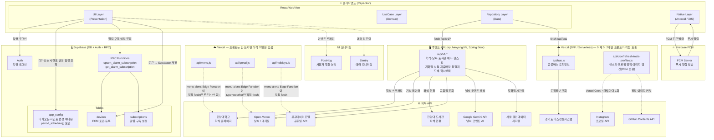

# 하냥냥 (Hanyangnyang) 프로젝트

한양대학교 학생 커뮤니티 앱. Capacitor 기반 하이브리드 앱으로 Android / iOS 동시 지원.

## 어플 소개글
에리카생에게 필요한 정보와 기능을 꾹꾹 눌러담은 서비스
한양대학교 ERICA 학생들을 위한 필수 캠퍼스 라이프스타일 유틸리티 앱, 하냥냥입니다!

주요 제공 기능
• 식당별 학식 조회
• 셔틀버스&지하철 시간표
• 단과대별 제휴 정보 모음 
• 날씨와 학정 혼잡도
• 편리한 학교 생활을 위한 기타 기능

하냥냥과 함께 더욱 슬기롭고 귀여운 에리카 캠퍼스 라이프를 즐겨보세요!

## 기술 스택

- **프론트엔드**: React + Vite (Capacitor WebView로 래핑)
- **Android**: Capacitor + Java (Kotlin 전환 예정)
- **iOS**: Capacitor (Codemagic으로 빌드)
- **백엔드**: 자체 백엔드 서버(`api.hanyang.life`, Spring Boot) — 학식·날씨·도서관 혼잡도·배너·헬스장·지하철·셔틀·제휴매장·통합피드백·학사달력(공휴일 포함)까지 대부분의 핵심 데이터를 여기서 서빙 (CORS 차단·API Key 보호 역할도 겸함)
- **BFF / API**: Vercel Serverless Functions — 공공버스 도착정보, 인스타그램 프로필 사진 정적 이미지 주기 갱신(Cron)만 남음. 학식·날씨·도서관·지하철·셔틀·공휴일은 전부 위 백엔드로 이전 완료
- **DB / Auth**: Supabase — 익명 Auth, FCM 구독·알림 설정(subscriptions·devices), app_config(다가오는 시간표 변경 배너용 period_schedule만 남음 — 나머지 셔틀 설정은 새 백엔드 `/api/v1/academic/status`로 이전). 앱 내 배너 자체는 더 이상 Supabase가 아니라 새 백엔드 `/api/v1/banners`가 서빙
- **푸시 알림**: Firebase Cloud Messaging (FCM) — Capacitor 네이티브(Android/iOS) + Web 동시 지원
- **에러 모니터링**: Sentry (@sentry/capacitor + @sentry/react, 프로덕션 빌드에서만 활성화)
- **사용자 분석**: PostHog
- **외부 API**: (백엔드 서버에서 호출) Open-Meteo(날씨·대기질), 서울 열린데이터(지하철), 공공데이터포털(공휴일), 한양대 도서관 API, Google Gemini(날씨 코멘트 AI 생성) / (Vercel에서 호출) 경기도 버스정보시스템, Instagram API, GitHub Contents API

## 아키텍처

### 데이터 흐름 원칙

- 앱은 외부 API를 **절대 직접 호출하지 않음** — 반드시 자체 백엔드 서버 또는 Vercel BFF를 경유 (자체 백엔드가 대부분을 흡수했고, Vercel은 공공버스·인스타 정적 이미지 갱신만 남음)
- Supabase는 클라이언트에서 직접 연결 (Auth·DB·RPC), 이제 app_config는 다가오는 시간표 변경 배너용 period_schedule만 조회
- FCM 토큰은 네이티브 레이어에서 발급 → Supabase에 저장 → 서버에서 발송

### 소스 코드 구조 (Clean Architecture)

```
src/
├── presentation/      # UI (React 컴포넌트, Hook, Context)
├── domain/            # 비즈니스 로직 (Entity, UseCase, Repository 인터페이스)
├── data/              # 데이터 레이어 (DataSource, Repository 구현체)
├── infrastructure/    # 플랫폼 종속 (HttpClient, SecureStorage)
├── lib/               # 외부 SDK 초기화 (firebase.js, supabase.js, platform.js)
└── di.js              # 의존성 주입 컨테이너
```

### 앱 초기 로딩(Boot) 시스템

**스플래시 화면 관리 규칙은 [src/BOOT_ARCHITECTURE.md](src/BOOT_ARCHITECTURE.md)** — `BootContext`의 `readyMap`/`markReady` 패턴, 새 로딩 항목 추가 방법, 과거 무한 스플래시 버그 사례와 "무엇을 이 시스템에 등록해야 하는가"의 판단 기준까지 포함. 앱 시작 시 필수적인 새 비동기 로딩을 추가하기 전 반드시 먼저 확인할 것.

### 아키텍처 다이어그램


```mermaid
graph TD
    subgraph Client["📱 클라이언트 (Capacitor)"]
        subgraph WebView["React WebView"]
            UI["UI Layer\n(Presentation)"]
            UC["UseCase Layer\n(Domain)"]
            Repo["Repository Layer\n(Data)"]
        end
        NativeLayer["Native Layer\n(Android / iOS)"]
    end

    subgraph Backend["🖥️ 백엔드 서버 (api.hanyang.life, Spring Boot)"]
        BackendAPI["/api/v1/*\n학식·날씨·도서관·배너·헬스장·\n지하철·셔틀·제휴매장·통합피드백·학사상태"]
    end

    subgraph Vercel["☁️ Vercel (BFF / Serverless) — 이제 이 2개만 프론트가 직접 호출"]
        BusAPI["api/bus.js\n공공버스 도착정보"]
        InstaCron["api/cron/refresh-insta-profiles.js\n인스타 프로필 정적 이미지 갱신(Cron 전용)"]
    end

    subgraph VercelLegacy["☁️ Vercel — 프론트는 안 쓰지만 아직 파일은 있음"]
        MenuAPI["api/menu.js"]
        PortalAPI["api/portal.js"]
        HolidaysAPI["api/holidays.js"]
    end

    subgraph ExternalAPIs["🌐 외부 API"]
        HanyangWeb["한양대학교\n학식 홈페이지"]
        OpenMeteo["Open-Meteo\n날씨 / 대기질"]
        LibraryAPI["한양대 도서관\n좌석 현황"]
        GovHolidayAPI["공공데이터포털\n공휴일 API"]
        GeminiAI["Google Gemini API\n날씨 코멘트 AI"]
        SeoulSubway["서울 열린데이터\n지하철"]
        GyeonggiBus["경기도 버스정보시스템"]
        InstaIG["Instagram\n프로필 API"]
        GithubAPI["GitHub Contents API"]
    end

    subgraph Supabase["🗄️ Supabase (DB + Auth + RPC)"]
        Auth["Auth\n익명 로그인"]
        subgraph Tables["Tables"]
            Devices["devices\nFCM 토큰 등록"]
            Subscriptions["subscriptions\n알림 구독 설정"]
            AppConfig["app_config\n다가오는 시간표 변경 배너용\nperiod_schedule만 보관"]
        end
        RPC["RPC Functions\nupsert_alarm_subscription\nget_alarm_subscription"]
    end

    subgraph Firebase["🔥 Firebase FCM"]
        FCMServer["FCM Server\n푸시 알림 발송"]
    end

    subgraph Monitoring["📊 모니터링"]
        PostHog["PostHog\n사용자 행동 분석"]
        Sentry["Sentry\n에러 모니터링"]
    end

    Repo -->|"fetch /api/v1/*"| BackendAPI
    Repo -->|"fetch /api/bus"| BusAPI

    BackendAPI -->|"학식 스크래핑"| HanyangWeb
    BackendAPI -->|"기상 데이터"| OpenMeteo
    BackendAPI -->|"좌석 현황"| LibraryAPI
    BackendAPI -->|"공휴일 조회"| GovHolidayAPI
    BackendAPI -->|"날씨 코멘트 생성"| GeminiAI
    BackendAPI -->|"지하철 시간표"| SeoulSubway
    BusAPI -->|"도착정보 조회"| GyeonggiBus
    InstaCron -.->|"Vercel Cron, 4개월마다 1회"| InstaIG
    InstaCron -.->|"정적 이미지 커밋"| GithubAPI

    MenuAPI -.->|"menu-alerts Edge Function이\n직접 fetch(프론트는 안 씀)"| HanyangWeb
    PortalAPI -.->|"menu-alerts Edge Function이\ntype=weather만 직접 fetch"| OpenMeteo
    HolidaysAPI -.->|"menu-alerts Edge Function이\n직접 fetch"| GovHolidayAPI

    UI -->|"익명 로그인"| Auth
    UI -->|"다가오는 시간표 변경 일정 조회"| AppConfig
    UI -->|"알림 구독 설정/조회"| RPC
    RPC --> Devices
    RPC --> Subscriptions

    NativeLayer -->|"FCM 토큰 발급"| FCMServer
    UI -->|"토큰 → Supabase 저장"| Devices
    FCMServer -->|"푸시 알림"| NativeLayer

    UI -.->|"이벤트 트래킹"| PostHog
    UI -.->|"에러 리포팅"| Sentry
```

### Vercel API 엔드포인트 요약

**이 표는 이제 프론트엔드 호출 기준으로는 대부분 사실이 아님 — 학식·날씨·도서관·지하철·셔틀·공휴일 전부 새 백엔드(`api.hanyang.life`)로 이전 완료.** 아래는 남아있는 Vercel 함수 파일과 실제 살아있는 이유.

| 엔드포인트 | 역할 | 외부 호출 대상 | 프론트엔드에서 호출? |
|---|---|---|---|
| `/api/menu` | 학식 HTML 스크래핑 + 파싱 | 한양대 홈페이지 | ❌ `/api/v1/menu`로 대체. Supabase Edge Function `menu-alerts`(푸시 발송)가 직접 호출해서 파일은 살아있음 |
| `/api/portal?type=weather` | 날씨·대기질 + Gemini 코멘트 | Open-Meteo, Gemini | ❌ `/api/v1/weather`로 대체. `menu-alerts`가 직접 호출해서 파일은 살아있음 |
| `/api/portal?type=library` | 도서관 좌석 현황 | 한양대 도서관 API | ❌ `/api/v1/library/seats`로 대체. 이 라우트는 아무도 안 불러서 완전히 죽음 |
| `/api/holidays` | 법정공휴일 여부 조회 | 공공데이터포털 | ❌ `/api/v1/academic/status`로 대체. `menu-alerts`가 직접 호출해서 파일은 살아있음 |
| `/api/bus` | 공공버스 도착 정보 조회 | 공공데이터포털-경기도 버스정보시스템 | ✅ 아직 이 Vercel BFF를 그대로 씀 |
| `/api/cron/refresh-insta-profiles` | 인스타 프로필 사진을 정적 이미지로 주기 갱신(Vercel Cron 전용, HTTP로 직접 호출 안 됨) | Instagram, GitHub Contents API | 해당없음 — 프론트는 결과 정적 이미지만 읽음 |

`/api/insta-proxy`(인스타 프로필 실시간 프록시)는 존재하지 않음 — 위 cron 기반 정적 이미지 방식으로 완전히 교체됨. 학식·날씨·도서관·지하철·셔틀·공휴일 전부 새 백엔드(`/api/v1/menu`, `/api/v1/weather`, `/api/v1/library/seats`, `/api/v1/subway/schedule`, `/api/v1/shuttle`, `/api/v1/academic/status`)로 이전 완료.

### Supabase 테이블 요약

| 테이블 | 용도 |
|---|---|
| `devices` | FCM 토큰 등록 (기기 식별) |
| `subscriptions` | 알림 구독 설정 (학식·날씨 알람 시간/조건) |
| `app_config` | 다가오는 시간표 변경 배너용 `period_schedule`만 조회 — 나머지 셔틀 설정(현재기간·공휴일·강제주말·미운행 오버라이드)은 새 백엔드 `/api/v1/academic/status`로 이전 완료 |

`banners`(앱 내 공지 배너)는 더 이상 Supabase 테이블이 아님 — 새 백엔드 `/api/v1/banners`로 이전 완료.

### FCM 푸시 알림 전체 흐름

#### ① 사용자가 알림 설정

```
앱 실행
  ↓
Supabase 익명 로그인 → device_id 발급 (UUID)
  ↓
OS/브라우저에 알림 권한 요청

  [네이티브 앱 - Android/iOS]
  PushNotifications.register() → OS가 FCM 서버에 기기 등록
  FCM.getToken() → 네이티브 FCM 토큰 발급

  [PWA / 브라우저]
  getToken(messaging, { vapidKey }) → VAPID 키 기반 웹 푸시 토큰 발급
  ↓
토큰 + 설정(시간·키워드·식당) → Supabase RPC 호출
  → devices 테이블      : { device_id, fcm_token, platform }
  → subscriptions 테이블 : { device_id, topic, notifyTime, params, is_active }
```

#### ② 알림 발송 (Supabase Edge Function)

```
Supabase Cron (대시보드 설정)
  → 매 1분마다 Edge Function(menu-alerts) 자동 호출
  → JWT service_role 검증으로 외부 호출 차단
  ↓
현재 KST 시각 확인
  ↓
Supabase DB 조회:
  subscriptions JOIN devices
  WHERE is_active = true AND notifyTime = 현재시각
  → 구독자 목록 + FCM 토큰 + platform
  ↓
토픽별 분기:

  [CAFETERIA_KEYWORD - 학식 알림]
  Vercel /api/menu 호출 → 오늘/내일 학식 데이터
  cafe 모드   : 선택한 식당 메뉴 → 알림 본문 조립
  keyword 모드 : 키워드 포함 메뉴 있을 때만 → 알림 본문 조립

  [WEATHER_ALERT - 날씨 알림]
  Vercel /api/portal?type=weather 호출
  비/눈·미세먼지·자외선 조건 체크 → 알림 본문 조립
  ↓
플랫폼별 FCM 메시지 페이로드 조립:
  네이티브 : notification + apns(iOS전용) + android 필드 포함
  웹(PWA)  : data-only (SW 이중 알림 방지를 위해 notification 제외)
  ↓
Firebase Admin SDK (Edge Function 내 npm 라이브러리)
  → 인증 키는 Supabase Secrets에 저장 (FIREBASE_PRIVATE_KEY 등)
  → FCM 서버 API 호출 (최대 500개씩 배치 병렬 발송)
```

#### ③ FCM 서버 → 각 기기 배달

```
FCM 서버
  ├─ Android → FCM 직접 전달 → OS → 시스템 알림 표시  (앱 꺼져도 수신 ✅)
  ├─ iOS     → APNs(Apple) 경유 → OS → 시스템 알림    (앱 꺼져도 수신 ✅)
  └─ PWA     → Web Push → 브라우저 엔진 → Service Worker → 알림 표시
                          (PWA 설치 + 브라우저 실행 중이면 수신 ✅)
```

#### 구성 요소 역할 구분

| 구성 요소 | 역할 |
|---|---|
| Supabase Cron | 매 1분마다 Edge Function 트리거 |
| Supabase Edge Function | 알림 발송 로직 전체 실행 (Deno/TS) |
| Supabase DB | 구독자 목록·FCM 토큰 저장소 |
| Supabase Secrets | Firebase 서비스 계정 키 보관 |
| Firebase Admin SDK | Edge Function 내 라이브러리 — FCM 서버 호출 담당 |
| Vercel API | 학식·날씨 데이터 제공 |
| FCM 서버 | 각 기기로 푸시 알림 배달 |

## 개발 원칙

- 코드 작성은 Claude Code와 함께, **개념 이해는 본인이 직접** — 면접에서 설명할 수 있어야 포트폴리오가 됨
- 모든 리팩토링/최적화는 **"측정 → 개선 → 수치"** 순서 — 계측(PostHog·Lighthouse·Profiler)을 항상 먼저
- Android 위젯 → Mac 세팅 → iOS 위젯 **순서 필수** (동시 진행 시 둘 다 느려짐)
- CI/CD는 9월 배포 전까지만 완성되면 됨
- 채팅은 백엔드 준비 상태 확인 후 착수 시점 결정

## 로드맵

**작업 우선순위의 단일 기준은 [docs/frontend-roadmap.md](docs/frontend-roadmap.md)** — FE 직무 포트폴리오 관점의 작업 단위 로드맵 (문제 스토리 · 해결 · 증빙 지표 · 체크리스트 포함). 리팩토링/최적화 작업 시작 전 반드시 이 문서를 먼저 확인하고, 완료 시 체크리스트를 갱신할 것.

요약 (2026-07 기준):

| 시기 | 작업 |
|------|------|
| 7월 | 폴링 캐시 완성(진행 중) → 위치정보 UX → 스크롤 분리 → TanStack Query 마이그레이션 → 번들·폰트·CWV 최적화 |
| 8월 | Android 위젯 (병렬 트랙, ~2주) ∥ TypeScript 점진 전환 병행 |
| 9월~ | 컴포넌트 분해·Storybook → Next.js 웹(검색용 경로) + 모노레포 |
| 9월 배포 전 | CI/CD (Android GitHub Actions) |
| 이후 | iOS 위젯 (Mac 세팅 후), 실시간 채팅 (백엔드 준비 후) |

## 제거된 기능 (복원 참고용)

### 도서관 로그인(인증) + QR 좌석 예약

한때 있었으나 **의도적으로 전부 제거된 기능**. 도서관 계정으로 로그인해서 입장용 QR 코드를 보고, 열람실 좌석을 조회·예약·반납하는 기능이었음.

- **제거 커밋**: `d9a0420` — "refactor: 사용하지 않는 도서관 로그인(인증) 및 QR/좌석 예약 관련 모든 기능 및 파일 제거" (2026-05-30, kdjidkr)
- **제거된 파일 20개**: `src/presentation/components/{QRView,LoginForm,ReserveForm}.jsx`, `src/presentation/hooks/useAuth.js`, `src/data/datasources/{Auth,Library}ApiDataSource.js`, `src/data/repositories/{Auth,Library}Repository.js`, `src/domain/repositories/I{Auth,Library}Repository.js`, `src/domain/usecases/{Login,Relogin,GetQRCode,GetSeat,ReserveSeat,CancelReservation,DischargeSeat}UseCase.js`, `App.jsx`/`di.js`/`BootContext.jsx`의 관련 연결부
- 이 커밋 이후에도 `domain/entities/{Room,Seat,QRCode}.js`, `presentation/hooks/{useQR,useSeat}.js`가 잔재로 남아있었는데, 2026-07-25에 마저 정리함 (di.js에 없는 `getQRCodeUseCase` 등을 import하고 있던 죽은 코드였음)
- API 쪽: `api/qr.js`, `api/seat.js`도 별도 커밋(`038939e` "도서관 좌석 예약 관련 미사용 API 7개 삭제")에서 제거됨

**복원하고 싶을 때**: 코드가 git 히스토리에 그대로 남아있으니 새로 짤 필요 없음.
```bash
# 삭제 직전 커밋(d9a0420^)에서 개별 파일 내용 확인
git show d9a0420^:src/presentation/components/QRView.jsx

# 삭제 직전 커밋에서 관련 파일 전체를 현재 워킹트리로 복원
git checkout d9a0420^ -- src/presentation/components/QRView.jsx src/presentation/components/LoginForm.jsx src/presentation/components/ReserveForm.jsx src/presentation/hooks/useAuth.js src/data/datasources/AuthApiDataSource.js src/data/datasources/LibraryApiDataSource.js src/data/repositories/AuthRepository.js src/data/repositories/LibraryRepository.js src/domain/repositories/IAuthRepository.js src/domain/repositories/ILibraryRepository.js src/domain/usecases/LoginUseCase.js src/domain/usecases/ReloginUseCase.js src/domain/usecases/GetQRCodeUseCase.js src/domain/usecases/GetSeatUseCase.js src/domain/usecases/ReserveSeatUseCase.js src/domain/usecases/CancelReservationUseCase.js src/domain/usecases/DischargeSeatUseCase.js
```
단, 이 코드는 지금(2026-07)의 클린아키텍처/DI 컨벤션 이전 스타일이라, 그대로 붙이기보단 현재 패턴(예: `PortalRepository.ts` 구조)에 맞춰 다시 짜는 셈 치는 게 나음. `api/qr.js`/`api/seat.js`는 `038939e^` 기준으로 같은 방식으로 복원 가능.
