# 😸 하냥냥 

한양대학교 ERICA 학생들을 위한 캠퍼스 라이프스타일 유틸리티 앱입니다.
Capacitor 기반 하이브리드 앱으로 Android / iOS를 동시에 지원합니다.

[](https://apps.apple.com/kr/app/하냥냥/id6770033067)
[](https://play.google.com/store/apps/details?id=com.hanyangnyang.app)

### 👥 개발자

| 역할 | 이름 | GitHub | Email |
|---|---|---|---|
| 프론트엔드 | 김예은 | [@yaeunjess](https://github.com/yaeunjess) | manlcoff@hanyang.ac.kr |
| 백엔드 | 김동준 | [@kdjidkr](https://github.com/kdjidkr) | kdjidkr@hanyang.ac.kr |

문의사항이 있다면 **hanyangnyang01@gmail.com** 으로 연락주세요!

## 📖 서비스 소개

에리카생에게 필요한 정보와 기능을 꾹꾹 눌러담은 서비스, 하냥냥입니다!
학식·셔틀버스·지하철·날씨·도서관 혼잡도 등 매일 확인해야 하는 캠퍼스 정보를 한곳에 모아
더 슬기롭고 귀여운 에리카 캠퍼스 라이프를 즐길 수 있도록 도와줍니다.

## ✨ 주요 기능

- 🍚 식당별 학식 조회
- 🚌 셔틀버스 & 지하철 시간표
- 🏫 단과대별 제휴 정보 모음
- ☁️ 날씨와 학정(도서관) 혼잡도
- 🔔 학식·날씨 맞춤 푸시 알림 (FCM)
- 🎓 그 외 편리한 학교 생활을 위한 기타 기능

## 🏗 프로젝트 아키텍처

앱은 외부 API를 직접 호출하지 않고, Vercel BFF(Serverless Functions)를 경유합니다.
Supabase는 Auth·DB·RPC 목적으로 클라이언트에서 직접 연결합니다.

```mermaid
graph TD
    subgraph Client["📱 클라이언트 (Capacitor)"]
        subgraph WebView["React WebView"]
            UI["UI Layer\n(Presentation)"]
            UC["UseCase Layer\n(Domain)"]
            Repo["Repository Layer\n(Data)"]
        end
        NativeLayer["Native Layer\n(Android / iOS)"]
    end

    subgraph Vercel["☁️ Vercel (BFF / Serverless)"]
        MenuAPI["api/menu.js\n학식 스크래핑"]
        SubwayAPI["api/subway.js\n지하철 시간표"]
        PortalAPI["api/portal.js\n날씨 · 도서관"]
        InstaAPI["api/insta-proxy.js\n인스타 프로필"]
    end

    subgraph ExternalAPIs["🌐 외부 API"]
        HanyangWeb["한양대학교\n학식 홈페이지"]
        SeoulOpenAPI["서울 열린데이터\n지하철 시간표"]
        OpenMeteo["Open-Meteo\n날씨 / 대기질"]
        LibraryAPI["한양대 도서관\n좌석 현황"]
        GovHolidayAPI["공공데이터포털\n공휴일 API"]
        GeminiAI["Google Gemini API\n날씨 코멘트 AI"]
        InstaIG["Instagram\n프로필 API"]
    end

    subgraph Supabase["🗄️ Supabase (DB + Auth + RPC)"]
        Auth["Auth\n익명 로그인"]
        subgraph Tables["Tables"]
            Devices["devices\nFCM 토큰 등록"]
            Subscriptions["subscriptions\n알림 구독 설정"]
            Banners["banners\n앱 내 배너"]
            Feedbacks["feedbacks\n피드백 수집"]
            AppConfig["app_config\n앱 설정값"]
        end
        RPC["RPC Functions\nupsert_alarm_subscription\nget_alarm_subscription"]
    end

    subgraph Firebase["🔥 Firebase FCM"]
        FCMServer["FCM Server\n푸시 알림 발송"]
    end

    subgraph Monitoring["📊 모니터링"]
        PostHog["PostHog\n사용자 행동 분석"]
        Sentry["Sentry\n에러 모니터링"]
    end

    Repo -->|"fetch /api/menu"| MenuAPI
    Repo -->|"fetch /api/subway"| SubwayAPI
    Repo -->|"fetch /api/portal?type=weather"| PortalAPI
    Repo -->|"fetch /api/portal?type=library"| PortalAPI
    Repo -->|"fetch /api/insta-proxy"| InstaAPI

    MenuAPI -->|"HTML 스크래핑"| HanyangWeb
    SubwayAPI -->|"시간표 조회"| SeoulOpenAPI
    PortalAPI -->|"기상 데이터"| OpenMeteo
    PortalAPI -->|"좌석 현황"| LibraryAPI
    PortalAPI -->|"공휴일 조회"| GovHolidayAPI
    PortalAPI -->|"날씨 코멘트 생성"| GeminiAI
    InstaAPI -->|"프로필 조회"| InstaIG

    UI -->|"익명 로그인"| Auth
    UI -->|"피드백 저장"| Feedbacks
    UI -->|"배너 조회"| Banners
    UI -->|"앱 설정 조회"| AppConfig
    UI -->|"알림 구독 설정/조회"| RPC
    RPC --> Devices
    RPC --> Subscriptions

    NativeLayer -->|"FCM 토큰 발급"| FCMServer
    UI -->|"토큰 → Supabase 저장"| Devices
    FCMServer -->|"푸시 알림"| NativeLayer

    UI -.->|"이벤트 트래킹"| PostHog
    UI -.->|"에러 리포팅"| Sentry
```



### 소스 코드 구조 (Clean Architecture)

```
src/
├── presentation/      # UI (React 컴포넌트, Hook, Context)
├── domain/            # 비즈니스 로직 (Entity, UseCase, Repository 인터페이스)
├── data/              # 데이터 레이어 (DataSource, Repository 구현체)
├── infrastructure/    # 플랫폼 종속 (HttpClient, SecureStorage)
├── lib/               # 외부 SDK 초기화 (firebase.js, supabase.js, platform.js)
└── di.js              # 의존성 주입 컨테이너
```

### Vercel API 엔드포인트

| 엔드포인트 | 역할 | 외부 호출 대상 | 캐시 TTL |
|---|---|---|---|
| `/api/menu` | 학식 HTML 스크래핑 + 파싱 | 한양대 홈페이지 | 1일 |
| `/api/subway` | 4호선·수인분당선 시간표 | 서울 열린데이터 | 30일 (로컬 번들) |
| `/api/portal?type=weather` | 날씨·대기질 + Gemini 코멘트 | Open-Meteo, Gemini | 매 정각 갱신 |
| `/api/portal?type=library` | 도서관 좌석 현황 | 한양대 도서관 API | no-cache |
| `/api/insta-proxy` | 인스타 계정 프로필 사진 | Instagram API | 30일 |

### Supabase 테이블

| 테이블 | 용도 |
|---|---|
| `devices` | FCM 토큰 등록 (기기 식별) |
| `subscriptions` | 알림 구독 설정 (학식·날씨 알람 시간/조건) |
| `banners` | 앱 내 공지 배너 |
| `feedbacks` | 사용자 피드백 수집 |
| `app_config` | 앱 레벨 설정값 (점검 메시지, 최소 버전 등) |

## 🛠 기술 스택

| 구분 | 사용 기술 |
|---|---|
| 프론트엔드 | React 19 + Vite (Capacitor WebView로 래핑) |
| 스타일링 | Tailwind CSS |
| Android | Capacitor + Java (Kotlin 전환 예정) |
| iOS | Capacitor (Codemagic으로 빌드) |
| BFF / API | Vercel Serverless Functions |
| DB / Auth | Supabase (익명 Auth, DB, RPC) |
| 푸시 알림 | Firebase Cloud Messaging (FCM) — 네이티브(Android/iOS) + Web 동시 지원 |
| 에러 모니터링 | Sentry (`@sentry/capacitor`, `@sentry/react`) |
| 사용자 분석 | PostHog |
| 테스트 | Playwright (E2E), Vitest |
| 컴포넌트 문서화 | Storybook |
| 외부 API | Open-Meteo(날씨·대기질), 서울 열린데이터(지하철), 공공데이터포털(공휴일), 한양대 도서관 API, Google Gemini(날씨 코멘트 AI), Instagram API |
